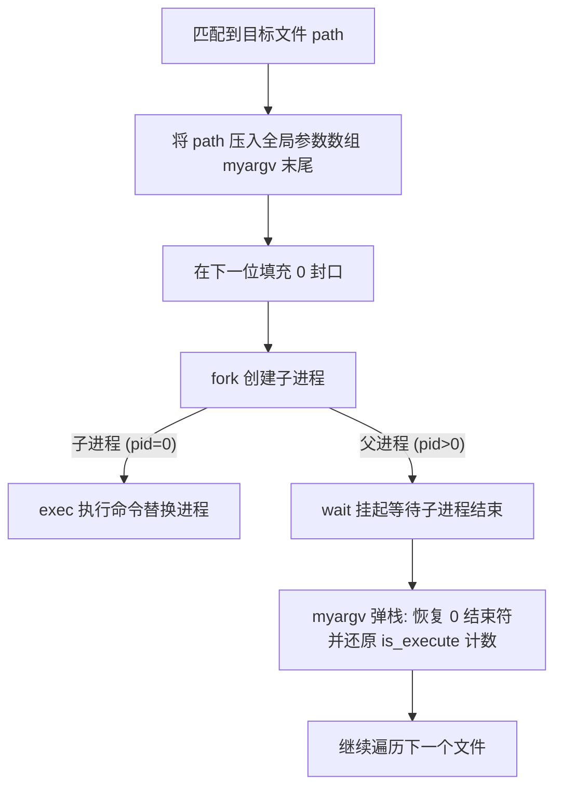

# Lab: Utilities 实验收获与技术总结

恭喜你圆满完成了 xv6 的第一个实验 **Lab: Utilities**，并取得了 **131/131** 的满分成绩！在本轮实验中，你不仅实现了一个工业级高水准的 `find` 命令（支持多级递归、-exec 进程控制和正则表达式），还编写了 `uptime` 实用程序，深刻理解了 Unix 系统的核心哲学与底层原理。

为了方便你后续复习和面试准备，我们对本轮实验的核心技术点、架构设计 and 经典 Bug 进行了系统化总结。

---

## 🏗️ 核心模块设计拆解

### 1. 递归查找与防死循环设计 (`find.c`)
在文件系统遍历中，`find` 通过读取目录文件（即一串连续的 `struct dirent`）来进行下钻。
* **内存对齐与直读**：`struct dirent` 包含 2 字节的 `inum` 和 14 字节的 `name`。通过 `read(fd, &de, sizeof(de))` 直接将磁盘字节流拷贝到结构体中，依赖 C 语言编译器在内存中的字节偏移对齐，实现免解析直读。
* **特殊项过滤**：必须使用**字面量完全匹配**（`strcmp`）来过滤掉 `.`（当前目录）和 `..`（父目录）。如果将其误判为普通子目录进行递归，会导致无限来回循环，最终因栈溢出（Stack Overflow）导致内核崩溃。

### 2. `-exec` 命令执行流与栈式状态恢复
你的 `-exec` 参数解析和多进程控制是非常优雅的闭环设计：

> [!TIP]
> **优雅的栈式状态恢复**：
> 在父进程中通过 `myargv[--is_execute] = 0;` 在原位置重新置为结束符，成功避免了每次匹配都重新分配内存的开销，极其高效地复用了全局参数缓冲区。

---

## 🐛 经典 Bug 与调试避坑指南

在调试过程中，我们一起解决了一些系统级编程中最容易遇到的“隐形陷阱”：

| 故障现象 | 根本原因分析 | 解决与避坑建议 |
| :--- | :--- | :--- |
| **测试提示 MISSING，但文件确实存在** | `strcmp` 的返回值判定写反（忘记其相等时返回 `0`）；以及 `switch-case` 分支因漏写 `break` 导致穿透到 `T_DIR` 逻辑。 | 使用 `!strcmp(a, b)` 或 `strcmp(a, b) == 0`；牢记 `switch` 是跳转标签，每个独立分支尾部必须有 `break`。 |
| **目录遍历时全部被 continue 跳过** | 逻辑门组合写错：`strcmp(tmp, ".") || strcmp(tmp, "..")` 永远为真（因为一个字符串不可能同时是点和双点）。 | 必须使用 `strcmp == 0 || strcmp == 0` 来做“是点或双点”的正面判定。 |
| **GDB 调试用户态程序时，变量全是乱码** | xv6 中所有用户态程序都从 `0` 地址开始加载，给 `find` 的虚拟地址下断点，会导致 `sh` 或 `init` 运行到相同地址时被错误拦截（地址别名）。 | **先起 Shell，再下断点**。先让 `sh` 完全启动，在敲入测试命令但按回车前，`Ctrl+C` 暂停 QEMU，再设置 `b find`。 |
| **编译报错：unknown type name 'uint'** | 头文件依赖顺序错误。`user.h` 内部使用了在 `kernel/types.h` 中定义的自定义类型 `uint`，但源码中只包含了前者。 | **黄金法则**：在 xv6 的任何 C 文件中，永远把 `#include "kernel/types.h"` 放在最顶部。 |
| **正则匹配 find . "a*b" 输出为空** | xv6 shell 极为简陋，不支持双引号的词法解析，它把双引号当成参数的一部分传给了 `find`（即 `\"a*b\"`）。 | 在简易的 xv6 命令行中调试正则时，**直接不要加双引号**，使用 `find . a*b` 即可。 |

---

## 🧠 系统级软件工程认知升华

* **进程空间隔离**：独立的用户态程序之间在运行时是彻底内存隔离的，`find` 无法直接调用 `grep.c` 里的 C 函数，只能通过在自身代码中包含其定义，或者编译链接时共同打包。
* **用户库自动链接 (`ULIB`)**：理解了 Makefile 的自动化构建逻辑。可执行文件的生成会默认与 `ulib.o`（字符串库）、`usys.o` ... 链接。这就是为什么我们只声明了 `printf` 就能直接调用的秘密。
* **子串匹配语义**：理清了简易正则引擎 `"a*b"` 代表的其实是匹配“零个或多个 a 后面紧跟一个 b”的**子串**。在物理目录项的排查上，字面量匹配 `strcmp` 比正则匹配 `match` 更加安全可靠。

---

> [!IMPORTANT]
> **下一阶段展望**：
> 下一个实验通常是 **Lab: system calls**（系统调用）。你会深入到内核内部，去学习如何给内核添加一个全新的系统调用（比如 `trace` 和 `sysinfo`），真正打破用户态与内核态的边界。
> 
> 带着在 Utilities 实验里建立起来的代码直觉和调试技巧，你已经为接下来的硬核内核之旅打下了无比坚实的基础！

祝你在接下来的 xv6 内核探索中取得更大突破！随时欢迎回来开启下一章的结对调试！
